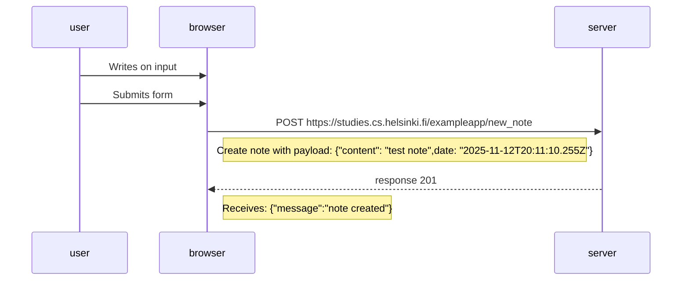

```mermaid
sequenceDiagram
participant user
participant browser
participant server

  user->>browser: Writes on input
 
  user->>browser: Submits form
  browser->>server: POST https://studies.cs.helsinki.fi/exampleapp/new_note
  Note left of server: Create note with payload: {"content": "test note",date: "2025-11-12T20:11:10.255Z"}
  server-->>browser: response 201
  Note right of browser: Receives: {"message":"note created"}
```
